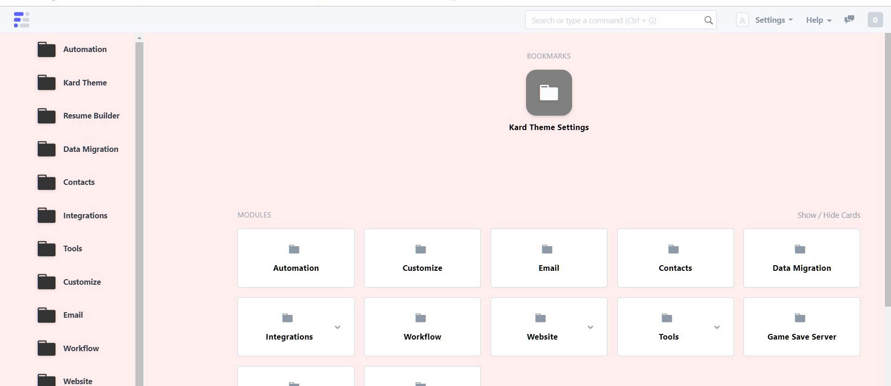

Kard Theme 

Custom App for Frappe V12 that modifies the desktop as well as some other css changes.
Has a settings page that customizes the theme.

Option to add User Desktop Shortcuts as in v11. With the ability to sort and hide.
	Shortcuts can be of type doctype or report or custom link.

Option to add a sidebar with a list of allowed modules.

Option to add a grid of icons consisting of allowed modules.

Option to hide the current v12 Desktop Cards.
	Adds a “Add to Desktop” link in the User Dropdown

Only shows for doctypes, pages and reports.

Notes

Frappe v11 used a doctype called desktop_icon to store user shortcuts, their order and standard shortcuts as well as icon appearance information.

This theme stores this info in a custom doctype called kard_desktop_icon.

Frappe v12 uses config files to determine what cards show on the desktop and what links/sections show on the module view page. 

This theme uses kard_desktop_icon instead of config files. Adding an entry with type “module” and checked as standard will show as an icon on the module grid/sidebar and will have a module view page.

The module view page shows all doctypes belonging to that module and displays them in sections.

Work In Progress

Installation

bench get-app kard_theme https://github.com/kardmode/kard_theme.git
bench install-app kard_theme [your_site_name]

